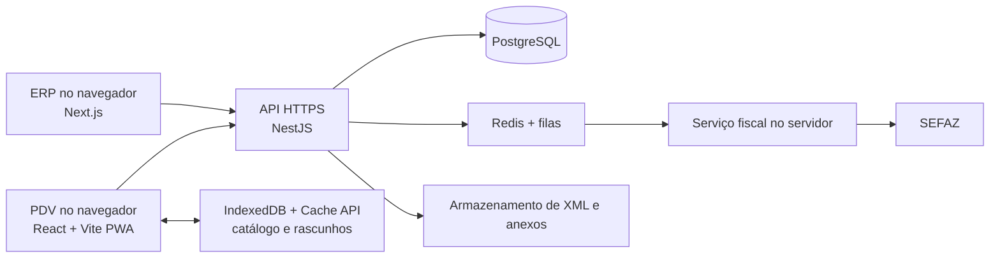

# EXPERT — Sistema ERP com PDV integrado

ERP e ponto de venda web para o piloto **CompreMai$ Estivas**, varejo supermercadista no **Rio Grande do Norte**. O painel administrativo e o PDV são acessados no navegador. A emissão de NF-e e NFC-e será implementada em uma etapa posterior, com serviço no servidor e homologação na SEFAZ.

> **Estado do projeto:** fundação executável em desenvolvimento. Há painel ERP, tela inicial do PDV, API local, esquema inicial do banco e escopo. Ainda não há cadastro operacional, venda, autenticação ou emissão fiscal. Esta versão não deve ser usada em produção.
>
> **Revisão do escopo:** 16 de setembro de 2026.

## Executar a primeira versão

Esta base foi compilada com Node.js 24.19.0 e pnpm 11.19.0. Os serviços escutam apenas em `127.0.0.1`. Em uma máquina de desenvolvimento com Node.js e pnpm instalados:

```bash
pnpm install
pnpm build
```

Abra três terminais na pasta do repositório:

```bash
pnpm dev:api
pnpm dev:admin
pnpm dev:pdv
```

| Serviço | Endereço local | Conteúdo atual |
| --- | --- | --- |
| Painel ERP | `http://127.0.0.1:3000` | Visão geral, estrutura de produtos e catálogo dos relatórios |
| PDV | `http://127.0.0.1:5173` | Tela de caixa, sem conclusão de venda |
| API | `http://127.0.0.1:3333/health` | Estado do serviço |
| Piloto | `http://127.0.0.1:3333/v1/pilot` | CompreMai$ Estivas, supermercado, RN |

O banco é opcional para abrir as telas. O PostgreSQL é necessário antes dos cadastros reais. Crie **um banco exclusivo para desenvolvimento**, copie `apps/api/.env.example` para `apps/api/.env`, configure `DATABASE_URL` e execute `pnpm db:migrate`. A rota `/health/db` mostra se a conexão foi configurada. Nenhuma credencial de banco deve ser incluída em commits.

```text
apps/
  admin/   Painel web em Next.js
  pdv/     Frente de caixa web em React e Vite
  api/     API em NestJS e migração inicial do PostgreSQL
docs/      Escopo revisado do projeto
```

O detalhamento funcional está na [planilha do escopo](docs/escopo_erp_pdv_web_revisado.xlsx).

A API recusa inicialização com `NODE_ENV=production` porque autenticação e autorização ainda precisam ser implementadas. O esquema já separa empresa, filial, departamentos e produtos, com CNPJ textual e data de cadastro. A migração foi preparada, mas ainda não foi aplicada a um banco local nesta etapa.

## Objetivo

Construir uma base de ERP para varejo com PDV integrado, começando pelo **CompreMai$ Estivas no Rio Grande do Norte**. A razão social, o CNPJ, o regime tributário e o contador responsável ainda precisam ser confirmados.

O sistema deve permitir a evolução para várias empresas, filiais e caixas sem misturar dados, números fiscais, estoques ou permissões. Os produtos concretos serão levantados com a loja antes dos primeiros cadastros.

## Escopo funcional

| Área | Primeiro produto utilizável | Evolução planejada |
| --- | --- | --- |
| Base | Empresas, filiais, usuários, perfis, auditoria e parâmetros fiscais | Administração avançada de múltiplas empresas |
| Cadastros | Estrutura de produtos, clientes e fornecedores; SKU, GTIN, unidade e classificação fiscal | Catálogos específicos, variações e importação em massa |
| Preços | Tabelas por loja e regras determinísticas de desconto | Promoções e campanhas mais complexas |
| Estoque | Movimentos, saldo por depósito, inventário e devoluções | Reposição, previsão e integrações externas |
| PDV | Abertura e fechamento de caixa, venda rápida, pagamentos registrados, cancelamento e conciliação | Integração TEF e adquirentes |
| Fiscal | NF-e 55 e NFC-e 65 online, eventos, DANFE, XML e guarda | Contingência adicional, somente após validação técnica e fiscal |
| Vendas | Orçamentos e conversão sem redigitação | DAV, se houver necessidade e regra local validada |
| Gestão | Relatórios fiscais de vendas, cadastro de produtos e desempenho por check-out | Entradas de mercadorias com compras; depois BI, CRM e fidelidade |
| Financeiro | Registros necessários à conciliação da venda e do caixa | Compras, contas a pagar e receber, bancos e conciliação completa |

O primeiro piloto terá **emissão fiscal online**. Um rascunho de venda poderá ser preparado sem conexão e sincronizado depois, mas não será apresentado como venda fiscal concluída enquanto não houver autorização da SEFAZ ou uma modalidade de contingência efetivamente homologada.

### Regras que devem ser verdadeiras em todo o sistema

1. Toda leitura, gravação, fila e arquivo é vinculada à empresa e à filial corretas.
2. Uma venda, um pagamento e uma solicitação fiscal possuem identificadores estáveis e chaves de idempotência. Duplo clique, timeout ou reenvio não criam duplicidade.
3. O estoque é atualizado por movimentos rastreáveis. Ajustes, devoluções e cancelamentos registram autor, motivo e vínculo com a operação original.
4. Os totais de itens, descontos, impostos e pagamentos são reconciliados antes de concluir a venda.
5. O documento fiscal registra um estado explícito, como `rascunho`, `pendente`, `em_contingencia`, `autorizado`, `rejeitado` ou `cancelado`. Contingência não é exibida como autorização da SEFAZ.
6. CNPJ é tratado como identificador textual, inclusive para o formato alfanumérico. Regras tributárias e schemas são versionados por vigência.
7. O certificado digital A1, o CSC e demais segredos permanecem no servidor. Eles não são distribuídos para o navegador.

## Arquitetura proposta



### Escolhas técnicas iniciais

| Componente | Proposta | Observação |
| --- | --- | --- |
| Painel ERP | Next.js, React e TypeScript | Interface administrativa web |
| PDV | React, Vite e PWA | Uso pelo navegador; instalação PWA opcional |
| Dados locais do PDV | IndexedDB, Cache API e Service Worker | Catálogo e rascunhos; não substituem o banco central nem o backup |
| API | NestJS e TypeScript | Módulos de negócio e contrato OpenAPI |
| Banco central | PostgreSQL | Transações, estoque e trilha de auditoria |
| Processamento assíncrono | Redis e BullMQ | Reenvio e jobs idempotentes |
| Serviço fiscal | PHP e NFePHP como candidatos | Validar manutenção, versões, licenças e aderência às notas técnicas antes da escolha final |
| Arquivos | Armazenamento de objetos, como MinIO | XML, protocolos, eventos e cópias externas |
| Entrega | HTTPS, containers e CI/CD | Hospedagem e custos ainda serão definidos |

O desenho começa modular. Um serviço fiscal separado pode ser útil pelo ecossistema de bibliotecas brasileiras, mas a escolha final depende de uma prova de integração e homologação. As versões de dependências serão fixadas quando o código for criado.

## Operação offline e periféricos

O PDV web poderá manter a interface, parte do catálogo e rascunhos no navegador. A sincronização ocorrerá quando a aplicação estiver aberta e a rede retornar. O sistema deverá testar perda de conexão, falha de gravação local, quota cheia, modo privado, fechamento do navegador e reenvio repetido.

Os dados locais do navegador podem ser removidos pelo usuário ou pelo próprio navegador em determinadas condições. A aplicação solicitará armazenamento persistente quando suportado, avisará sobre rascunhos não sincronizados e jamais considerará o cache local como backup. A sincronização em segundo plano será auxiliar, pois seu suporte varia entre navegadores.

A impressão inicial usará o diálogo do navegador, com layout adequado para a impressora térmica escolhida. Impressão silenciosa, gaveta, balança e comunicação direta com dispositivos exigem testes por **sistema operacional, navegador e modelo**. APIs como WebUSB e Web Serial não serão consideradas compatíveis sem essa homologação. Leitores de código de barras que funcionam como teclado poderão ser testados no fluxo comum do PDV.

Uma solução fiscal realmente offline, com assinatura, numeração, DANFE e transmissão posterior, ainda depende de uma decisão específica. A viabilidade para um produto que permaneça 100% no navegador deverá ser demonstrada e aprovada para a UF do piloto antes de constar como funcionalidade disponível.

## Emissão fiscal

Fluxo previsto:

1. Validar venda, cliente, produtos, valores, tributação e eventual vínculo com orçamento ou DAV.
2. Aplicar regras fiscais versionadas por empresa, filial, UF, operação e vigência.
3. Gerar XML e validar o schema aplicável.
4. Assinar no servidor com certificado protegido.
5. Transmitir à SEFAZ; em timeout, consultar o estado antes de reenviar.
6. Guardar XML, protocolo, eventos e trilha de tentativas.
7. Imprimir ou enviar o documento adequado ao estado fiscal.
8. Processar cancelamento, inutilização, correção e reconciliação quando cabíveis.

Antes da produção serão necessários credenciamento, certificado, CSC para NFC-e, séries, numeração, regras tributárias revisadas por contador, testes de impressora, backup e homologação na UF escolhida. O projeto acompanhará as notas técnicas da NF-e/NFC-e, inclusive mudanças relacionadas ao **CNPJ alfanumérico** e à **Reforma Tributária do Consumo (IBS/CBS)**. A aplicação não deve assumir que uma versão de leiaute ou regra fiscal permanecerá válida indefinidamente.

## Relatórios

Todos os relatórios terão filtro de período, empresa e filial, respeitarão o fuso horário da filial e poderão ser consultados na tela ou exportados. Valores de custo e margem exigem permissão específica. Os resultados devem ser reproduzíveis a partir das operações registradas, inclusive após alteração de preços, custos ou departamentos no cadastro.

| Relatório | Visões e filtros | Informações principais | Fase prevista |
| --- | --- | --- | --- |
| Vendas NFC-e e NF-e | **Sintética:** dia ou mês, modelo fiscal, departamento e classe da curva ABC. **Analítica:** documento e item, com filtros por período, filial, modelo, departamento, produto e classe ABC. | Quantidade de documentos e itens, venda bruta, descontos, devoluções, venda líquida, custo histórico dos itens, margem bruta em valor e percentual. Na visão analítica: data, número/chave, SKU, descrição, quantidade, preço, desconto, venda líquida e custo. Gráfico de evolução das vendas no período. | Fiscal online |
| Cadastro de produtos | Período pela **data de cadastro**, departamento, status, SKU e usuário responsável. | Data e hora de cadastro, SKU, descrição, departamento, unidade, GTIN quando houver, status e usuário que cadastrou. | Fundação |
| Entradas de mercadorias | Período pela **data da entrada confirmada**, fornecedor, filial, departamento e documento de origem. Visões sintética por fornecedor/departamento e analítica por item. | Data da entrada, fornecedor, documento, produto, quantidade, custo unitário e custo total da entrada; ajustes e devoluções identificados separadamente. | Compras e financeiro |
| Vendas do PDV por check-out | Período, filial, check-out, operador e turno/abertura de caixa. | Vendas concluídas, itens, valor bruto, descontos, valor líquido, cancelamentos e **ticket médio por check-out**. | PDV online |

### Regras dos indicadores

- A venda fiscal entra no relatório pela **data de emissão da filial**, desde que o documento esteja autorizado. Documentos cancelados ou rejeitados não compõem a venda líquida; devoluções aparecem separadamente e ajustam o resultado quando vinculadas à venda original.
- O custo de cada item é registrado na venda conforme o método de custeio definido para o estoque. O relatório usa esse valor histórico, sem recalcular vendas passadas pelo custo atual do produto. **Método de custeio ainda pendente de definição.**
- A curva ABC é calculada por produto, em ordem decrescente de venda líquida no período e filtros escolhidos. Como ponto de partida: A até 80% acumulado, B acima de 80% até 95%, C acima de 95%. Os limites e o tratamento de devoluções serão confirmados antes da implementação. O gráfico temporal mostra a evolução diária ou mensal.
- **Ticket médio por check-out = soma do valor líquido das vendas concluídas no check-out ÷ número dessas vendas.** Vendas canceladas não entram no numerador nem no denominador; devoluções são exibidas à parte. O valor total do PDV e o fiscal devem ser conciliados por venda, sem somar duas vezes a mesma operação.
- Os totais da visão sintética devem coincidir com a soma da analítica para os mesmos filtros. Uma mudança posterior de departamento não altera o departamento histórico registrado na venda ou na entrada.

## Segurança, dados e operação

- Autorização no backend por papel e escopo de empresa/filial; MFA para administradores.
- Sessões revogáveis, cookies seguros, proteção contra abuso e registro de ações críticas.
- Segredos e certificado digital fora do código e fora do navegador.
- Dados pessoais tratados conforme finalidade, acesso, retenção e direitos aplicáveis da LGPD.
- Backups externos com teste real de restauração; metas de perda de dados e tempo de recuperação serão definidas antes do piloto.
- Logs, métricas e alertas desde a primeira loja, sem registrar senhas, certificados ou dados sensíveis desnecessários.
- Testes de isolamento entre empresas, valores monetários, estoque, permissões, falhas de rede, timeout fiscal e rejeições SEFAZ.

As entidades iniciais previstas são `empresa`, `filial`, `usuario`, `perfil`, `departamento`, `produto`, `preco`, `cliente`, `fornecedor`, `deposito`, `movimento_estoque`, `entrada_mercadoria`, `item_entrada`, `caixa`, `venda`, `item_venda`, `pagamento`, `documento_fiscal`, `evento_fiscal` e `auditoria`. Venda e entrada guardarão os dados históricos necessários aos relatórios. O modelo definitivo será desenhado com os produtos e processos reais do piloto.

## Roadmap

Os prazos abaixo são **indicativos**. Eles serão recalculados após a definição de equipe, backlog, UF, integrações e equipamentos.

| Fase | Janela inicial | Entrega verificável |
| --- | --- | --- |
| 0. Descoberta | 2 a 3 semanas | Processos, matriz fiscal, protótipo, decisões de escopo e backlog aprovados |
| 1. Fundação | 3 a 4 semanas | Login, isolamento, cadastros base, relatório de produtos por data de cadastro, auditoria, deploy e restauração testados |
| 2. PDV e estoque online | 4 a 6 semanas | Venda, caixa e estoque conciliados sem duplicidade; ticket médio por check-out |
| 3. Fiscal online | 6 a 10 semanas | NF-e/NFC-e e eventos homologados na UF piloto; vendas sintéticas e analíticas com custo e curva ABC |
| 4. Offline web limitado | 3 a 5 semanas | Rascunhos recuperáveis e sincronização idempotente |
| 5. Piloto | 2 a 4 semanas | Uma loja operando com periféricos testados e fechamento diário reproduzível |
| 6. ERP financeiro | 4 a 8 semanas | Compras, títulos, bancos, conciliação e relatório de entradas por fornecedor/departamento aprovados |
| 7. Escala | Contínua | Multi-loja e integrações medidas por capacidade, custo e suporte |

Cada fase depende do aceite da anterior. O piloto só entra em produção após os testes de segurança, restauração, operação de caixa e homologação fiscal aplicáveis.

## Decisões pendentes

- Confirmar razão social, CNPJ, regime tributário e contador responsável do CompreMai$ Estivas. Segmento e UF do piloto já foram definidos.
- Definir os **produtos reais** do sistema na próxima etapa: categorias, SKUs, variações, GTIN, unidades, preços e classificações fiscais.
- Definir o método de custeio do estoque e confirmar os limites da curva ABC com a gestão.
- Decidir se DAV faz parte do primeiro produto e validar suas regras na operação escolhida.
- Escolher equipamentos, navegadores e sistemas operacionais do caixa.
- Definir como serão confirmados e conciliados cartão e PIX; TEF depende de provedor e contrato.
- Definir hospedagem, domínio, custos operacionais, metas de disponibilidade e recuperação.
- Avaliar separadamente a viabilidade de contingência fiscal sem componente local instalado.

## Como começar a implementação

Os comandos para abrir a fundação local estão no início deste README. A sequência de implementação é:

1. Fechar as decisões acima com os responsáveis de negócio, operação e fiscal.
2. Detalhar os produtos e os fluxos reais de venda e estoque.
3. Transformar o escopo em histórias com critérios de aceite e contratos de API.
4. Criar os projetos de frontend, PDV, API, banco e serviço fiscal.
5. Construir a fundação, automatizar testes e avançar pelas fases do roadmap.

Contribuições futuras devem incluir testes para regras de negócio e migrações de banco. Não inclua certificados, CSC, senhas, XML de clientes ou dados pessoais reais em commits, issues ou exemplos públicos.

## Custos e licença

A preferência por componentes sem custo obrigatório de licença **não significa operação gratuita**. Hospedagem, backup, certificado digital, contador, periféricos, adquirentes, suporte e eventuais provedores podem gerar custos. A licença deste repositório ainda não foi definida; não presuma permissão de reutilização ou distribuição até que um arquivo `LICENSE` seja publicado.

## Referências

- [Portal Nacional da NF-e: manuais](https://www.nfe.fazenda.gov.br/portal/listaConteudo.aspx?tipoConteudo=ndIjl+iEFdE%3D)
- [Portal Nacional da NF-e: notas técnicas](https://www.nfe.fazenda.gov.br/portal/listaConteudo.aspx?tipoConteudo=04BIflQt1aY%3D)
- [Receita Federal: CNPJ alfanumérico](https://www.gov.br/receitafederal/pt-br/acesso-a-informacao/acoes-e-programas/programas-e-atividades/cnpj-alfanumerico/cnpj-alfa)
- [Receita Federal: orientações da Reforma Tributária em 2026](https://www.gov.br/receitafederal/pt-br/acesso-a-informacao/acoes-e-programas/programas-e-atividades/reforma-tributaria-do-consumo/orientacoes-2026)
- [MDN: IndexedDB](https://developer.mozilla.org/en-US/docs/Web/API/IndexedDB_API)
- [MDN: armazenamento e remoção de dados no navegador](https://developer.mozilla.org/en-US/docs/Web/API/Storage_API/Storage_quotas_and_eviction_criteria)
- [MDN: impressão pelo navegador](https://developer.mozilla.org/en-US/docs/Web/API/Window/print)
- [MDN: sincronização em segundo plano](https://developer.mozilla.org/en-US/docs/Web/API/Background_Synchronization_API)

As normas, notas técnicas, bibliotecas e capacidades de navegador devem ser verificadas novamente no momento da implementação e antes de cada implantação fiscal.
